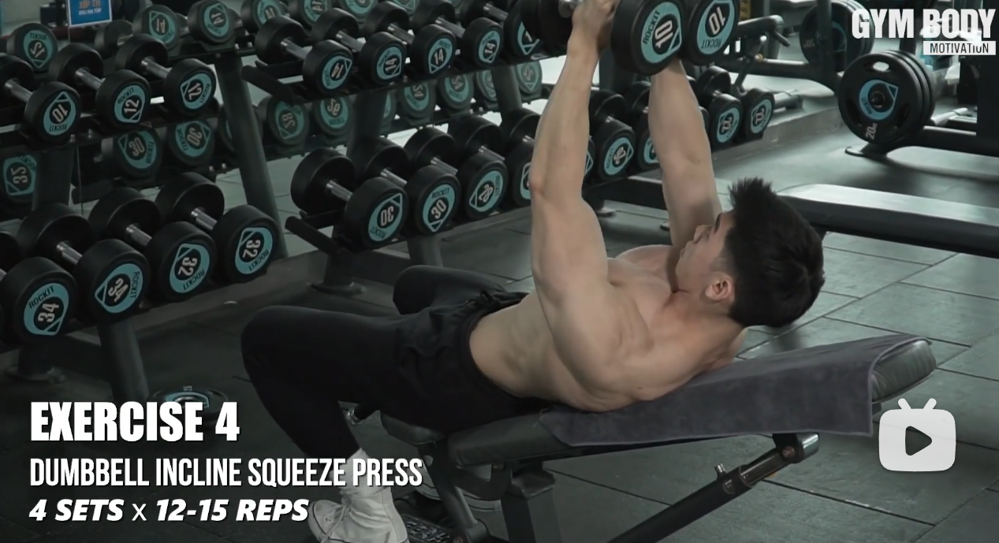

1. 热身

首先你要活动肩关节，你可以做绕环，就是胳膊一圈圈的转，转个10圈，（别转猛了）然后躺在凳子上空手，不拿哑铃来20下卧推,休息一下，然后用3磅哑铃做12下卧推。其实也就是小重量的开始做.

2. 平板哑铃卧推：4组 * 12-15 组间1-2min

3. 史密斯上斜/平板卧推 4组 * 12-15 组间 1-2min

4. 哑铃上斜/平板飞鸟：4组 * 10-12 组间 1-2min

5. 哑铃上斜/平板挤压卧推 4组 * 12-15 组间 1-2min

6. 胸部飞鸟机 4组 * 12-15 组间 1-2min

7. 下斜杠铃卧推 4组 10-12 组间 1-2min

8. 膝关节俯卧撑

9. 放松 选择动作 3,4 胸肌拉伸用这样的方式，记得看清楚，拉伸的一侧和往前迈的脚，是同一侧  

---------

**杠铃卧推细则**

1. 起始姿势

仰卧长凳 将杠铃放在乳头上方。 　　

眼睛应该恰好位于杠铃的正下方。这是你应该将背部撑成反弓形，从侧面看就像一座拱桥，腰部悬空，只有肩部和臀部接触长凳。接下来双肩后张，加紧肩胛骨，你会感受到背后的两片肩胛骨在中间靠拢，在整个过程中肩部都要保持这个姿势，这一点在卧推中非常非常非常重要。 

在把杠铃从卧推架上去下来之前，调整调整呼吸，集中注意力，这时你的脑中应该没有任何与训练无关的内容。想象全身的力量集中在胸肌上，血液流进胸肌，仿佛你只能感到胸肌的存在。

另外，在健身房里经常看到一些人在推起杠铃时会将肩膀伸出来，这样三角肌前束和肱三头肌会过多地参与用力，使胸肌尤其是上胸肌的训练效果大打折扣，很多人认为平板卧推不能练上胸肌就是这个原因。其实用正确的姿势做平板卧推可以练到整个胸肌。 

2. 动作过程　　 

双手以宽于肩的握距正握杠铃，拇指扣在食指上。合适的握距应该使小臂在动作最低点时基本垂直于地面。握距太窄肱三头肌会过多参与从而减弱对胸肌的刺激，握据太宽只能锻炼胸肌外侧。

收缩胸肌，然后慢慢将杠铃下降至中胸处，在乳头上偏上的位置，下降的同时用鼻子吸气。杠铃在最低点不接触胸肌而是保持一个微小的距离。在下降的过程中一直保持胸肌的紧张，用胸肌控制杠铃而不是胳膊。想象胸肌用力的方向是向上推起杠铃但主动向下退让使杠铃下降。在最低点不要停顿，直接把杠铃推起至肩部正上方，同时用嘴呼气，也可以在推起时屏住呼吸度过停滞点（推起过程中难度最大时）后再呼气。可以看出杠铃运动的轨迹并不是直上直下，而是与竖直面成一个小角度，这样在最高点可以增加对上胸肌的刺激。这里再次强调推起时要保持肩膀的正确姿势，不要将肩膀伸出来。在推起到最高点时停顿约一秒钟，做顶峰收缩（在动作定点用力收缩目标肌）。然后下放杠铃开始下一次动作。

简单地说：将杠铃垂直上举至两臂完全伸直，胸肌彻底收缩，静止一秒钟，慢慢下落。 

3. 呼吸方法　　 上举时呼气，下落时吸气。 

4. 注意要点　　上举时背部、臀部要平贴凳面，两脚用劲下踏 

5. 卧推流程要点　　 

卧推是一个复合动作，既涉及到多个关节的动作，参与运动的有肩关节和肘关节。胸肌只控制其中肩关节的运动，将上臂从两侧拉向胸前。而肘关节的运动是由肱三头肌来完成，使胳膊从弯曲变成伸直状态。所以在做卧推时不应将注意力放在将胳膊有屈伸直推起重量，而应集中体会胸肌将上臂从两侧向中间拉拢的过程，感受胸肌收缩的过程。因为我们中的大多数人都是想练出形态饱满线条分明的肌肉，而不是练举重，所以就应该集中体会肌肉的收缩和伸展，而不是举起重量。 

6. 关于推起和还原下放时间长短　　 

推起过程一到两秒，顶峰收缩约一秒，还原下放过程三到四秒。在重量不大时也可以采用稳定的爆发用力 

-----------

**哑铃卧推细则**

1. 起始位置：　　 

仰卧在平的卧推凳上，两脚平踏在地上。两肘弯曲，握住哑铃，拳眼相对，手心朝腿部的方向，哑铃的轴线位于乳头上方1厘米处（胸肌中部），抵住胸部。 

2. 动作过程： 哑铃卧推 　　

向上推起，两肘内收，夹肘的同时夹胸。哑铃向上的同时略向前偏，呈抛物线的运动轨迹。两臂伸直时，哑铃重心接近处于肩关节的支撑点上。但不要正好位于肩关节的支撑点上，这样会使骨骼支撑住哑铃的重量（这种由骨骼而不是肌肉支撑重量的情况称为“锁定”），使得胸肌放松，影响锻炼效果。然后，使两直臂向两侧张开，两臂慢慢弯屈，哑铃垂直落下，下降至最低处时，即做上推动作。重复。 

3. 呼吸方法：　　上举时吸气，避免缺氧；下放时呼气，尽量向下放，以达到伸展肌肉。 

4. 锻炼部位：　　胸大肌、三角肌和肱三头肌。 

5. 训练要点：

- 不要把背和臀部拱起或憋气，这样会使肌肉失去控制，是危险的。
- 在练胸大肌的同时，应加强上臂肱三头肌的锻炼。没有发达的三头肌，就不可能卧推起大重量的杠铃，也就不能练出发达的胸大肌。
- 起始时，要把哑铃的轴线置于乳头上方1厘米处（胸肌中部），才能让胸大肌发力。如果哑铃举在肩膀上，只能锻炼肩部肌肉。
- 一定要注意将两肘展开，做卧推时双臂在体侧张开，因而能基本上只靠胸肌用力来完成动作。宽间距时主要锻炼胸大肌，窄间距时主要锻炼三角肌。
- 胸部肌肉练习效果不理想。可试试上斜推举，躺在有一定的倾角（约 20—25度）的斜板上，再以同样重量的杠铃或哑铃进行练习。由于从另外一个角度给予肌肉一个新的刺激，你很快就会看到新的效果。 

6. 组数与次数：　　 

- 在6—8次范围内达到极限次数。多于8次，身体其它部位将进入有氧运动状态；如果少于6次，说明辅助肌已参与了运动，而主肌还没有完全疲劳。
- 多组数：无论哪个身体部位都必须一组接一组练到神经突触发不出冲动为止。如果你轻信了训练过度的说法，肯定达不到这个要求。所谓训练过度，不过是些懦夫为掩饰自己的无能而编造出来的借口。真正的冲击式锻炼不光要做到20组以上，还要把每组都做到极限次数。算组数时不要把热身组计算在内，尽管它们是必需的。
- 训练的多样性。要经常变化训练的组数与次数，以及动作的安排，以打破身体的适应，获得肌肉的突破性增长

-------------

平板卧推图解 

 

 

注意点： 

1. 小臂是否垂直于地面 以下是正确动作  

 

 

2. 注意小臂需要全程垂直于地面，以下是错误动作，分别靠前、靠后、靠外、靠内  

 

 

 

 

3. 握法：需要手腕发力（右侧握法为正确）  

 

4. 沉肩（超级重要）  

 

 

你的腋窝关节，这里有一块肌肉叫做冈上肌，会跟你的肩膀骨骼磨损，尤其在你没有沉肩的时候。（当你的腋窝张开到90度角，就会磨损肩关节） 

以下是错误动作的正面视图  

 

以下是正确动作  

 

以下是侧面沉肩正误动作  

 

5. 哑铃是否拿成八字 我们会要求哑铃是否拿成八字，与大臂平行，也是为了沉肩的这个概念。并且哑铃是始终八字型的，整个动作过程中不变化角度的。 我们要求卧推哑铃和大臂是水平平行的，飞鸟是成V字。

哑铃如果会了垂直，那么杠铃就简单多了，杠铃就只有两个错误，过分向前或者向后。杠铃的错误，一般来说是握距的错误导致的。所以不会出现向内或者向外的错误。  

---------------

上斜哑铃卧推

上斜哑铃卧推跟平板的要求是一样的，就是小臂垂直于地面。 只是要注意的是，平板的垂直于地面跟垂直于身体是一回事儿，而上斜和下斜的卧推不是这样的。

请观察，小臂是否垂直于地面  

 

--------------

杠铃卧推注意点： 

1. 握距太宽或者太窄  

 

2. 小臂是否垂直于地面，确切来说小臂是否垂直于地面是握距太宽或者太窄的结果。 

3. 但是前后的小臂是否垂直于地面，跟哑铃卧推是没区别的。（也就是说，前后左右看，你的小臂应都是与地面垂直的） 

4. 一般来说，沉肩了之后，杠铃要求落在乳头位置附近，但由于女人的乳头高度不一，此时需要想象成男人乳头的高度。  

 

上图：红色圈圈是沉肩，黄色圈圈指的是垂直于地面

-----------

仰卧飞鸟 

 

动作要点： 

1. 检查胳膊是否弯曲。  

 

飞鸟需要胳膊微曲，也就是上图第二个，千万不要做成第三个或者角度小于第三个 

2. 要有抱球的概念（需要找到一种抱的感觉！）  

 

3. 胸肌是否始终紧绷 

4. 一定一定要慢，尤其退让动作，越慢越好，要找到自己的胸肌始终在绷紧的感觉。