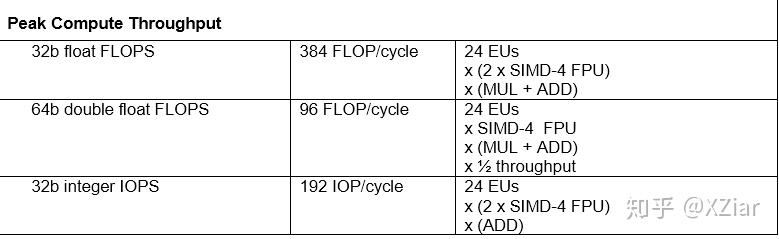

[toc]

本文转载 [XZiar知乎](https://zhuanlan.zhihu.com/p/102049728)


Intel的核显，通常以genX划分代际，内部俗称GEN。

但最近研究了很多与之架构相关的内容，就总结一下写出来。

对于各代包含的具体型号与参数，维基上介绍得很详细了。

[Intel Graphics Technology en.wikipedia.org](https://en.wikipedia.org/wiki/Intel_Graphics_Technology)

在这里就着重写一些内部设计和概念，其中很多内容也是来自于官方的架构文档。

[Intel® Processor Graphics software.intel.com](https://software.intel.com/en-us/articles/intel-graphics-developers-guides)

之前还回答过对gen11的看法，不过现在看来还是存在不少错误，以这里的为准。

[如何评价英特尔第十代酷睿处理器（10纳米）及Gen11核显](https://www.zhihu.com/question/326636533/answer/906657666)

* * *

## EU (Excution Unit)

GEN的最核心模块是EU（Excution Unit）。


这张图从haswell的gen7.5^[[1]](https://zhuanlan.zhihu.com/p/102049728#ref_1)^一直用到icelake的gen11^[[2]](https://zhuanlan.zhihu.com/p/102049728#ref_2)^，可以说是非常ya经gao典的结构了。（gen11的pdf用的另一张图，但换汤不换药。）

如图所示，一个EU里存在7个thread，称作`EU thread`。这个thread和软件层面的thread不同，即OpenCL/CUDA/OpenGL/DirectX/Vulkan等API里的thread不等于一个EU thread。

每个thread具有一系列`GRF（通用寄存器）`和`ARF（架构相关寄存器）`，互不共享。他们后边挂着一个thread arbiter线程派发器，下面挂着4个单元。**每个周期，7个EU thread中最多能有4个被各挑出一条指令，送给不同的后端单元**。

从这一角度看，EU thread的真实身份就很明确了，对应到软件层面就是**OpenCL/Vulkan/OpenGL里的`subgroup`**，**CUDA里的`warp`**，**DirectX里的`wave`**；对应到其他厂商就是**AMD的`wavefront`**，**NVIDIA的`warp`**。

## ISA^[[3]](https://zhuanlan.zhihu.com/p/102049728#ref_3)^

```
[(pred)] opcode (exec-size|exec-offset) dst src0 [src1] [src2]
```

GEN的ISA，每条指令是16字节（128bit）。对于一些特殊的常见指令，（如大多数float MAD），还可以启用compact，将指令缩减到8字节（64bit）。

## SIMD

GEN的SIMD设计比较神奇。熟悉的人应该知道NVIDIA的warp大小是32，而AMD的wavefront大小是64（虽然RDNA又设计了一套SIMD32^[[4]](https://zhuanlan.zhihu.com/p/102049728#ref_4)^）。但Intel的SIMD是“可变”的。

事实上，**SIMT和SIMD不是互斥的**：SIMT将粒度放小到单个线程，方便了开发；而硬件上不可能无节制地提供自由度，于是通常用SIMD来实现更高的效率。而**将SIMT映射到SIMD时不可避免地会丢失一部分自由度，这也就是subgroup/warp/wave产生的原因**。

subgroup将多个线程绑定在一起，同步运行，每个线程操作一个scalar的话，这一组线程的操作数刚好就能合并到一起构成一个vector。

subgroup等定义规定了这几组线程会同步做同样的操作，但并不意味着在硬件层面他们要同时完成同一个操作。举个例子就是AMD的GCN架构，对外开放SIMD64，内部ALU其实是SIMD16^[[4]](https://zhuanlan.zhihu.com/p/102049728#ref_4)^，一组wavefront分四个周期发给ALU。

同样的，既然硬件层面和软件层面的SIMD lane数量解耦了，ASM层面的SIMD也可以和软件层面的不一致。想象一下如果64个线程里只有一个线程要做一项操作，怎么办？你可以：

1.  用mask设定好只让那个线程对应的lane生效 。
2.  在ASM层面说明这个操作只需要一个SIMD lane去完成。

GEN就是用了后者的设计。ASM里每条指令开头都会有 `(SIMD x)`，这里的x就说明了有几个lane要进行操作，x可以是1/2/4/8/16/32。其中32似乎只能用在byte数据做Load/Store上，而某些操作指令也对x有限制。

当然ASM层面的SIMD是编译后才知道的，由编译器决定。对于那些运行时才能知道是否操作的情况，GEN同时提供了mask的方式。

同时由于SIMD得在编译后才能确定的，在进行OpenCL之类的编程时可能需要手动查询，你得到的通常是ASM中存在的最大的一个SIMD。当然你也可以手动提示编译器按某种SIMD去编译，这个就先不多讲了。

## 寄存器

每个EU具有28KB的GRF，每个EU thread具有4KB。这4KB是由128个SIMD8的寄存器组成的，每个寄存器是SIMD8-256bit，可以看作是**128个YMM寄存器**，ASM写法是r0~r127。

虽然每个SIMD channel是32bit，但访问时粒度可以细到字节8bit。所以，访问时需要带上格式标识，例如`b`(byte)，`w`(word)，`d`(dword)，`ud`(unsigned dword)，`hf`(half float)，`f`(float)，`df`(double float)等。

通过格式标识指定了单位元素的数据格式后，加上前面提到的SIMD lane标识，一条指令要访问多少数据也就可以确定。

但是指定访问的数据可能并不是连续的，甚至不一定是规则的，而GEN恰好提供了一种很奇特的寄存器寻址方式。

[Introduction to GEN Assembly](https://software.intel.com/en-us/articles/introduction-to-gen-assembly)

```
RegNum.SubRegNum<VertStride;Width,HorzStride>:type
```

简单来说，设计成SIMD8是有特殊意义的。

每个寄存器从上往下排列，就构成了一张2维网格，GEN的ISA允许指定寄存器号（行号），起始寄存器位置（列号），横竖方向stride，宽度（每行提取几个元素），从而实现了非常自由而又非常别扭的寻址方式。


而这个2维网格又使得寄存器可以按bank排列（如8个bank)，降低硬件设计复杂度的同时尽可能保证访问单个完整寄存器的吞吐性能。不过这也会带来bank conflic的问题，在一些特定情况下降低吞吐率。

前面的链接里还提到了一些ARF，不同代GEN的ARF可能有些差异。

其中最常使用的寄存器是

*   `acc#` 累加寄存器，这个寄存器提供了64bit精度，一些计算时会用到。
*   `f#.#` flag寄存器，用来存mask

ARF和GRF不同之处就在于，一些指令的一些操作数不能寻址ARF，或者一些指令隐含ARF作为操作数（如mac和mach隐含acc）。

GEN的ISA还**允许寄存器间接寻址，即将寄存器的内容作为寄存器地址来进行访问**。我之前也不相信这类指令真的存在，直到前两天我亲眼见证了……

r[a0.0]&amp;lt;0;1,0&amp;gt;，将a0.0的内容作为寄存器号

## 执行单元

EU里有且仅有4个执行单元，其中两个是FPU（其实应该算是ALU），一个是Send，一个是Branch。

*   **两个ALU都是SIMD4-128bit，相当于SSE ALU**。这两个ALU都支持32bit FMA，所以计算FLOPS时要x2。其中一个ALU（假定为ALU1）还支持一些复杂数学计算。
*   Send用于和外界模块交换信息，其中最基本的操作就是用于访存（相当于Load/Store）。有意思的是线程的退出/结束也是靠Send完成的。
*   Branch用来处理if/else之类的分支操作。

### ALU

ALU可以说是最基础最重要的单元了，每一代之间也有细微区别：

*   gen7.5到gen9^[[5]](https://zhuanlan.zhihu.com/p/102049728#ref_5)^，ALU还支持对16bit integer（short）以SIMD8进行操作，但不支持MAD。
*   gen11的ALU支持 SIMD8 INT16 MAD，但考虑到icelake的铺货程度，驱动的开发自然也不是很完善，IGC编译器似乎要手动往注册表里填选项才会开启Integer MAD的生成。
*   gen8^[[6]](https://zhuanlan.zhihu.com/p/102049728#ref_6)^开始，两个ALU都“原生”支持32bit整数运算，gen7.5只有一个ALU支持。
*   gen11的文档里说现在只有一个ALU（假定为ALU0）支持整数运算了（退化回gen7.5么）。
*   gen8开始，ALU支持half float，并且是支持以SIMD8的形式进行FMA操作。换句话说**理论上半精度吞吐率是单精度的两倍**。
*   ALU中的其中一个（假定为ALU1）支持64bit double运算，不过吞吐量只有单精度的一半。合计下来**理论上双精度吞吐率是单精度的四分之一**。

其实去翻阅ISA文档的话还是能看出很多区别的，但那就得讲上好久了。

到目前为止，GEN核显对FP16的支持一直是很良心的（对比一下[NV家消费级显卡各种阉割FP16和FP64](https://www.zhihu.com/question/302130912/answer/530296300)）。

现在AI领域开始往INT8模型逐步迁移，AVX512也开始加入VNNI的支持。INT8运算或许不会快太多，但在内存开销上的节省可能对核显十分有利。

INT8的整数操作是一直没有被GEN支持的。不过也不用担心，面包会有的，等gen12吧，而且到时候蛋糕也会有的。

### Send

Send一般用来做访存，这个单元还会顺便做coalescence，即把SIMD lane对同一地址的访问合并到读取单个元素并broadcast，或把对连续地址的访问合并到一组cache line访问，再按需要做swizzle。

* * *

## Subslice

终于脱离EU了。EU往上一层是subslice，这个概念是gen7.5（haswell）引入的。在这之前的架构文档并不详细，但似乎没有提供相似的架构设计。


如图所示，一个subslice内包含有N个EU，一个Dispatcher，一个sampler，一个Data Port。

为什么用N呢？因为不同代里N是有区别的。例如gen7.5就是10个EU，gen8到gen11是8个EU。gen12又改大到了16，还顺便把subslice改了个名。

EU和外部沟通只有两条路，从dispather传入指令，从send传出访存等请求到sampler和data port。简单来说，UAV访问一般走DataPort，SRV访问一般走Sampler。

## Sampler

熟悉图形API的就明白这是什么东西了，纹理采样器。

Sampler有一些特殊的职责：

*   纹理通常有多个维度，定位需要一个多维下标。Sampler负责做下标到逻辑地址的转换，并做边界检查等。
*   纹理通常具有一些特殊的格式，可能需要Sampler做转换，如BCx、ETC、ASTC这样的纹理压缩格式，以及sRGB的gamma矫正。
*   纹理的存储方式可能不是线性的，例如分块存储能提高局部缓存命中率，同时也适应一些纹理压缩格式。
*   纹理的下标可能不是整数，访问时可能要做插值（双线性，或者各项异性过滤）。

纹理是只读的，所以Sampler对外只有一条64 byte/cycle的读取通道。Sampler内具有L1和L2 Cache用来提高吞吐量。

Sampler带缓存而dataport不带的做法和kepler的设计有点像，不过更准确地说kepler是为immutable的数据设计了cache，不只局限于texture。

## DataPort

DataPort相当于一条直通外部的马路，支持双向64 byte/cycle。

之前的[文章](https://zhuanlan.zhihu.com/p/97374000)末尾讲过，GEN访问数据是要提供Binding Table的，即便是bindless，其实也只能说是indirect，把Binding Table放在了额外的内存区域而已。Send单元向外发送访存message时就要附带Binding Table Index。

[XZiar：OGL和OGLU的Texture binding​](https://zhuanlan.zhihu.com/p/97374000)zhuanlan.zhihu.com

不过SVM这种host/client共享虚拟地址的访存操作怎么进行，我就不确定了。

## SLM （Shared Local Memory）

把SLM拎出来讲的原因是，**gen11把SLM放到了subslice里，而在这之前，SLM是放在subslice外面，嵌在slice共享区的L3里的。**


如图所示，把SLM提到subslice后，EU就多了一条直连SLM的数据通道，带宽也是64 byte/cycle。之前几代的SLM嵌在L3里，不但带宽和访存通道共享，延迟也更高。现在GEN的L3总算是有更高的可用度了。

不过gen11和以前一样，**每个subslice拥有64KB的SLM**。

在CUDA的概念里，SLM是一个ThreadBlock间共享的。在OpenCL的概念里，**SLM是一个WorkGroup共享的**。由此可见，**GEN的subslice可以类比到NV的SM，AMD的CU**。

* * *

## Slice

Subslice的作用是把多个EU和访存模块组合起来。但像光栅化这样的操作也是需要硬件单元来提供功能的。而这部分模块就被放在Slice里，叫做Slice Common。


对于gen7.5，一个slice由2个subslice组成，所以GPU至少有20个EU。而gen8开始，一个slice包含3个subslice，所以粒度是24个EU。

不过事实上12个EU的gen9核显也是存在，对于这类产品，每个subslice都被阉割到6个EU^[[7]](https://zhuanlan.zhihu.com/p/102049728#ref_7)^，所以12个EU就是slice里有2个subslice，18EU就是slice里有3个EU。还有更为奇葩的23个EU，似乎是良品率问屏蔽了一个单独的EU。

原先slice设计起来是为了给产品线划分GT1、GT2等方便用的，GT几就给几个slice。但在gen11，一个GPU只有一个slice，但一个slice内包含的subslice数量却可以随意变化了。

而到了gen12，多slice设计又回来了，毕竟要出独显了（特指非DG1），规模堆得会大，全部放进一个slice是挺麻烦的。

Slice里有一组Fixed function units，其中包含了图形API所需要的光栅化/Z缓冲检测之类的功能，并有一些相应的cache，这部分模块和Dispatcher连在一起。

而在底部，Sampler和DataPort又共同连到一块统一的L3。L3里还包含了Atomics/Barries的支持。另外在gen11以前SLM也在L3里。

L3对外连接到GTI（Graphics Technology Interface），读取带宽都是64 byte/cycle。而写入带宽在gen7.5上仅为一半32 byte/cycle，往后的架构上则为满速64B/clk，并支持半速运行以节能。

## L3

**L3看着是一整块，但内部也是分成多个bank的**，一般来说每个slice对应4个bank，每个bank提供64 byte/cycle的带宽。考虑到完整的slice 有3个subslice，共有6条64 byte/cycle的通道连到L3上，他们其实可能是没法全部满载的。不过全部满载的情况也基本不可能出现就是了，瓶颈应该在更往前的地方。

对于图形类应用，L3中的一部分可以被配置为URB （Unified Return Buffer）^[[8]](https://zhuanlan.zhihu.com/p/102049728#ref_8)^。URB可以用来存储图形管线各个阶段需要访问的数据，特别是需要和EU外部模块共享的数据。常见的就是各个阶段间传递的数据（例如VS到PS间的varying，用于提供给光栅化单元做插值）。

**对于gen11前的架构，SLM嵌在L3里，换句话说SLM其实是L3的一部分，L3是能被配置成不同用途的：SLM，URB和L3**。而文档里列出来的L3大小只是能配置的最大L3大小。

对于gen7.5，L3是每个slice给4x128KB，最多256KB配置为L3。

对于gen8~gen9，L3是每个slice给4x192KB，最多512KB配置为L3。

对于gen10（是的gen10算是存在的），这个数字继续按比例增长。

到了gen11，数字变成4x384KB了，SLM独立到subslice中，L3最多能配置到384KB每个subslice，对于64EU（8 subslice）就成了3MB。

至于gen12，看这趋势还会继续涨吧。

* * *

## Unslice

没错，在slice外面还有一层unslice。这就好比是CPU部分的core和uncore。


Unslice是整个GPU共享的，主要包含了图元装配/曲面细分之类的功能。此外视频相关的编解码/后处理的硬件单元也放在这里。

## Gen11的改进

值得注意的是，gen11相比前几代做出了许多改变

*   引入了POSH（Position Only Shading Pipeline），其实就是个TBR，移动端很常见。


TBR的优点就是对显存压力可能会比较小，因为render target被划分成了多个小块，每次对RT的读写都只局限于这个tile，局部性强。NV从Maxwell开始的架构也或多或少带有TBR的设计思路^[[9]](https://zhuanlan.zhihu.com/p/102049728#ref_9)^。

TBR的优点和比较可以参考站内的这几篇文章：

[肖雄：移动GPU和桌面GPU最核心的差别（讲述TBR和Immediate Rendering）​](https://zhuanlan.zhihu.com/p/25730897)zhuanlan.zhihu.com[Tile-based 和 Full-screen 方式的 Rasterization 相比有什么优劣？​](https://www.zhihu.com/question/49141824/answer/136096531)www.zhihu.com

*   带来了CPS（Coarse Pixel Shading），相当于硬件层面的降分辨率渲染，是MSAA的反向操作，不过这个似乎要软件跟着做支持。
*   AdaptiveSync也加进来了，可以看作是支持了freesync。

## GTI

GTI的一端连着L3，另一端连着ring bus。

Ring bus把各个CPU core、GEN GPU、LLC（CPU的L3）、SystemAgent等给挂在一起，允许每个站点指向性地发送信息。并且由于总线的使用是流水线式的而不是独占的，常常被称作“核心越多带宽越高”。

不过事实上两点之间的带宽是一定的，核心多了只会拉长ring增加延迟而已。

把GPU挂在ring bus上还是有好处的。ringbus其实是好几个ring，其中就包含了snoop ring^[[10]](https://zhuanlan.zhihu.com/p/102049728#ref_10)^，这个ring可以用来监听缓存同步信息。

CPU和核显为了实现高效的异构运算，是允许共享同在DRAM中的数据的，而这容易带来一致性问题。而挂在ringbus上就可以把GPU当作一个CPU core来协调一致性问题了。

AMD的做法是CPU和GPU挂在IF总线上，其实算是大同小异，因为IF总线也分消息线和数据线。

此外，LLC是被集中放置并允许被多个CPU Core共享的（GPU里的L3也是类似做法），既然核显可以看作一个CPU Core，那自然也就有可能把CPU的L3当作L4来提高缓存命中率。当然这么做也有和CPU争缓存的风险。

* * *

## 番外：如何计算FLOPS

其实官方文档里写得非常简洁明了：

gen9 HD530

* * *

对GEN的解析就暂且告一段落。后续我会将Intel，AMD，NV三家的架构做一些浅显的比较（毕竟开源文档丰富性是Intel>>AMD>>NV）。

## 参考

1.  [^](https://zhuanlan.zhihu.com/p/102049728#ref_1_0)gen7.5 <https://software.intel.com/sites/default/files/managed/4f/e0/Compute_Architecture_of_Intel_Processor_Graphics_Gen7dot5_Aug4_2014.pdf>
2.  [^](https://zhuanlan.zhihu.com/p/102049728#ref_2_0)gen11 <https://software.intel.com/sites/default/files/managed/db/88/The-Architecture-of-Intel-Processor-Graphics-Gen11_R1new.pdf>
3.  [^](https://zhuanlan.zhihu.com/p/102049728#ref_3_0)GEN ISA <https://software.intel.com/en-us/articles/introduction-to-gen-assembly>
4.  ^^[a](https://zhuanlan.zhihu.com/p/102049728#ref_4_0)^^[b](https://zhuanlan.zhihu.com/p/102049728#ref_4_1)^RDNA <https://gpuopen.com/wp-content/uploads/2019/08/RDNA_Architecture_public.pdf>
5.  [^](https://zhuanlan.zhihu.com/p/102049728#ref_5_0)gen9 <https://software.intel.com/sites/default/files/managed/c5/9a/The-Compute-Architecture-of-Intel-Processor-Graphics-Gen9-v1d0.pdf>
6.  [^](https://zhuanlan.zhihu.com/p/102049728#ref_6_0)gen8 <https://software.intel.com/sites/default/files/Compute%20Architecture%20of%20Intel%20Processor%20Graphics%20Gen8.pdf>
7.  [^](https://zhuanlan.zhihu.com/p/102049728#ref_7_0)12EU/slice <https://en.wikichip.org/wiki/intel/microarchitectures/gen9#Scalability>
8.  [^](https://zhuanlan.zhihu.com/p/102049728#ref_8_0)URB <https://bwidawsk.net/blog/index.php/2015/09/gen-graphics-and-the-urb/>
9.  [^](https://zhuanlan.zhihu.com/p/102049728#ref_9_0)NV-TBR <https://www.realworldtech.com/tile-based-rasterization-nvidia-gpus/>
10.  [^](https://zhuanlan.zhihu.com/p/102049728#ref_10_0)<https://www.anandtech.com/show/3922/intels-sandy-bridge-architecture-exposed/4>