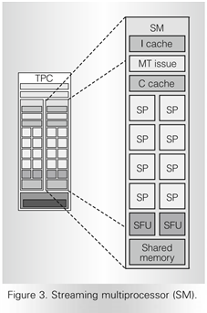
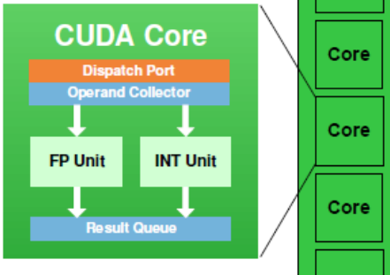
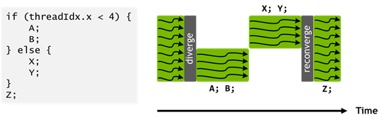
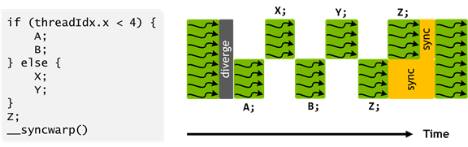

[toc]

本文转载 [XZiar的知乎](https://zhuanlan.zhihu.com/p/258196004)

## 流处理器 (Stream Processor)

首先要提到一个流处理器的概念。

从DX9时代过来的人应该都知道那场大变革，顶点渲染和像素渲染在DX10被合并成“统一渲染”。虽然对于开发者来说，vertex shader和fragment(pixel) shader的概念依旧存在，但底下执行的单元却被统一了，即由流处理器来进行处理。

这么做是有原因的，当时的游戏有些注重顶点运算，有些注重像素运算；而GPU里也存在着顶点管线和像素管线的说法，两者的比例并不是固定值。显然，不同的游戏有不同的最佳比例，由此也引申出了A黑游戏、N黑游戏的说法^[[1]](https://zhuanlan.zhihu.com/p/258196004#ref_1)^。

DX10统一两条管线，相当于把两种单元从静态分配改为动态分配，能提高资源的利用率。

AN两家也跟着DX10推出了各自的新一代显卡，而其中N家的G80架构有着巨大革新，奠定了未来的N卡架构。

对于现在的N卡架构来说，流处理器数量即CUDA Core数量。

## Scalar

Scalar也就是标量，这算是G80引入的一大革新之一。

通常来说，GPU是给渲染设计的，运算的对象要么是颜色RGBA，要么是坐标XYZW，都是向量。于是早期的GPU都是对一个4单位的向量进行操作。

而G80提出了通用计算的概念，这意味着运算的对象可能是其他东西，不一定能凑成4单位的向量了。为了提高通用性，G80就引入了标量计算的概念，运算粒度变小了，而同期的AMD只是在旧架构上做修改，依旧是4D向量。

在这之后，所有的N家架构图中都有密密麻麻的SP格子，但硬件上是不是真的如图上一样做成一个个Scalar ALU，那就不得而知了。以我的经验与看法，我更倾向于把这看作是宣传物料，硬件上还是SIMD ALU。至于说真正实现Scalar的，很可能只是ISA。

## AoS与SoA，SIMD与SIMT

这里得插一段来介绍一下SIMD。有些人可能觉得奇怪，N家的架构不是一直标榜SIMT吗，怎么又扯到SIMD了。但我认为SIMD和SIMT并不矛盾。

SIMD是单指令，多数据。但具体到程序设计里，这SIMD又有两种用法。这里^[[2]](https://zhuanlan.zhihu.com/p/258196004#ref_2)^介绍了两种数据组织方式，一种是Structure of Array(SoA)，另一种是Array of Structure(AoS)。

```
struct SOAPoint
{
    float x[N];
    float y[N];
    float z[N];
    float w[N];
};
struct AOSPoint
{
    float x;
    float y;
    float z;
    float w;
};
AOSPoint points[N];

```

如上所示，SoA是把一堆标量聚集在一起，然后按照所需的数据结构去排布。而AoS是先按照所需的数据结构去排布，然后再组成数组。

通常来说AoS的做法不太适合SIMD。因为数据结构里可能不止是xyzw的坐标，还可能有rgba的颜色，甚至一堆不相干、非向量的数据，这意味着你常要对不同的数据做不同的处理，而冗余数据还会影响内存局部性。如果是128bit的SSE，可以一条指令计算坐标一条指令计算颜色。但万一是256bit的AVX呢？坐标和颜色就很难用同一条指令去做相同的计算了。

而SoA就不一样了，一堆x坐标放在一起，做的是同样的运算。SSE和AVX的区别只是循环的步长不一样而已。（当然要是涉及到xyzw间互相运算就麻烦了）

那这有什么意义呢？联想一下SIMT，单指令，多线程，做同样的操作，一共N个线程……这不就是SoA嘛？！

换句话说，以前的GPU是AoS，每次操作坐标或者颜色的4个分量。现在的GPU是SoA，每次操作x个线程去运算同一个分量。这么做的好处就是不用局限于SIMD4，而与之相对的，对于单个线程来说，每次运算的也就变成了标量。

正如AoS和SoA只是SIMD的两种用法一样，新旧GPU也只是对SIMD单元的用法做了改变。你可以想象一个MxN的网格，以前按行处理，现在按列处理而已。

（当然更复杂的还有AoSoA等，就不细说了）

## CUDA (Compute Unified Device Architecture)

CUDA是NVIDIA伴随着G80推出的。虽然名字以architecture结尾，但CUDA这个词却有很多不同的用法。

CUDA可以是和OpenCL、OpenGL类似的一种API，也可以算作装有N卡的平台。后来GPU里的向量单元被称作CUDA Core。

而CUDA的本质，是在GPU上跑通用计算。

CUDA使用PTX(Parallel Thread eXecution)来作为ISA。注意这并不是底层硬件用的ISA，而是一种Virutal ISA，Intel也有类似的东西叫VISA。PTX的作用是在源码和硬件指令集间建立一个通用、兼容的中间格式，你可以把它理解为C++到ASM之间的LLVM IR，或者是SPIR-V、DXIL，只不过并不是SSA形式的^[[3]](https://zhuanlan.zhihu.com/p/258196004#ref_3)^。

GPU的架构变化频繁，没有很固定的ISA，每代之间通常都有改变，所以分发机器码很容易出现不兼容或者不优化的情况。分发源码的话一来容易被破解，二来会浪费时间在一些重复的parsing、通用优化上。所以大家通常会建立一种比较兼容的中间格式。

## Warp

随着CUDA引入的，还有个Warp的概念。

CUDA编程时，你只需要写单个线程要做的事情，然后指定多少个线程去跑就行了（它们可以被组织成1D、2D、3D的形式）。

但Warp的存在，意味着线程和线程之间并不是完全独立的，X个线程会被困成一束，一起执行。和SIMD一样，SIMT也有局限性。而对于N家卡，目前所有架构的X都是32。

## SM (Steaming Multiprocessor)

SM单元的概念正是随着G80架构出现的。`Streaming Multiprocessor`和`Stream Processor`很相似，但看得出前者范围比后者大。

不过SM单元也随着时代变迁发生了许多巨大的变化。这篇文章就主要谈一谈SM的发展。

* * *

## **G80 & Tesla**

G80架构算是Tesla架构的前身，但两者的差别其实不大。G80的SM是第一代，Tesla的是第二代。Tesla正好赶上4位数的型号`GeForce 8&9`用完，所以型号转回3位数的`GeForce x00`。

G80Tesla GTX200

注意，第一张^[[4]](https://zhuanlan.zhihu.com/p/258196004#ref_4)^是G80架构的TPC(Texture/Processor Cluster)，里面实际上有2个SM^[[5]](https://zhuanlan.zhihu.com/p/258196004#ref_5)^。G80的SM本质上是8个SP，2个SFU，以及大小为16KB的SLM。

Tesla的SM做了些改变^[[6]](https://zhuanlan.zhihu.com/p/258196004#ref_6)^，增加了1个独立的DP单元用于做双精度FMA。而且SFU现在也能做单精度乘法了^[[7]](https://zhuanlan.zhihu.com/p/258196004#ref_7)^（相对应的，SP能做FMA运算等效为2倍吞吐）。

值得注意的是，SM的频率是GPU频率的两倍，这是从GeForce7传承下来的特性。

### SP

这里重点讲一下SP，SP就是CUDA Core的前身。

Tesla架构中的ALU只支持24bit的整数乘法，完整32bit运算要多条指令来模拟，所以当时很多API有mul24的指令^[[8]](https://zhuanlan.zhihu.com/p/258196004#ref_8)^用于提速。

虽然SP是针对标量的，SIMT的宣传也是瞄准了标量，但实际执行时还是没法做到单一线程这么细的粒度。按照Anandtech的说法^[[9]](https://zhuanlan.zhihu.com/p/258196004#ref_9)^，G80的VS和PS具有不同的粒度————VS是16顶点，PS是32像素。 而到了Tesla架构，wrap概念被广泛使用，调度粒度被确定为32。

ALU执行是流水线化的，即一项操作会被分为X个步骤由X个组件去处理，每个步骤都耗费1周期。虽然一条指令要X周期才能执行完，但对于每个组件只要1周期就执行完了，所以每个周期都能送入一份数据进ALU。

可以看到一个SM下只有8个SP，SFU就更少了，而调度的粒度却比8要大，这正好用上了流水线的设计。测试也证明^[[10]](https://zhuanlan.zhihu.com/p/258196004#ref_10)^，一个wrap需要4周期才能被SP完全消化。

值得注意的是，SP的频率是调度单元（以及外部纹理单元等）的2倍，所以在调度单元看来，是需要2周期去消化1条指令。

根据前面的测算^[[10]](https://zhuanlan.zhihu.com/p/258196004#ref_10)^，SP的latency最短24cycle（这里说的是ALU的cycle），包括整数加减，24bit乘法，浮点的加减乘（包括FMA），逻辑运算。32bit整数的乘法需要96cycle，fma还需要多24cycle。可以看出当时的GPU依旧是很明显的浮点为主。

多亏了流水线，密集运算下一个warp依旧只需要`24+3`cycle就能完成运算，而不是`24*4`。不过为了保证ALU持续工作，理论上需要6个active warp持续使用ALU。

SFU能做的操作很多，浮点乘法和SP一样只要24cycle，`sin`和`cos`三角函数通常要48cycle，`log`和`rsqrt`就只要28cycle。还有一个问题是，按照Anantech的说法^[[11]](https://zhuanlan.zhihu.com/p/258196004#ref_11)^，SFU和调度单元整合密切，使用SFU将会阻塞整个SM。这个问题会在Fermi架构中修复。

DPU则达到了48cycle，毕竟还要支持FMA，运算过程中的精度爆炸。

### GRF & Cache

Tesla只有16K个32bit寄存器，共64KB。

每个线程分配到的寄存器数目是4的倍数，所以有理由怀疑内部是4个32bit为一组。而线程分配以64为步长而非warp的32，有点奇怪。

SLM共16KB，划分为16个bank，访问延迟大概在38cycle的样子^[[10]](https://zhuanlan.zhihu.com/p/258196004#ref_10)^。

* * *

## **Fermi**

Fermi

Fermi的SM架构图更详细了，SP被重新命名为CUDA Core。可以看到SM里有2组各16个CUDA Core，1组共16个LDST的访存单元，还有1组共4个SFU。不清楚DP单元应该被归到哪里（Anandtech说^[[12]](https://zhuanlan.zhihu.com/p/258196004#ref_12)^是1/3的CUDA Core能做DP，但是这数量不够整除啊）。

这四组可以看作是4个执行端口，看到这想必有人能联想到Intel的EU架构吧……


可以看到Intel的EU也有4组执行单元并且其中2组是FPU/ALU，不过区别在于Intel的一些复杂运算是交给FPU去做的，并且1组单元是branch。而对于Fermi，CUDA Core只能做FP或者INT运算，而branch之类的指令大概是被处理成目标是mask的整数/逻辑操作了。

Fermi的一大亮点在于，SM里有2个warp scheduler、Dispatch Unit，这意味着每周期可以从2个warp中各发射1条指令。这2条指令会被送到不同端口。从这个角度看Fermi的SM差不多就是Tesla的2个SM合并得来的，不过SP单元翻倍了。

注意DP是不支持2个warp共同发射的，按wiki的说法^[[13]](https://zhuanlan.zhihu.com/p/258196004#ref_13)^是DP要复用两组SP的数据线。


一个端口下只有16个CUDA Core，依旧小于warp的32线程，所以如图所示，其实需要2个周期才能把warp的指令完全送入ALU。再考虑到双倍频率，调度单元是真正做到每个周期1条指令了。SFU只有4个，一个warp要消耗（占用）8个周期，不过它不再阻塞SM调度了。

### CUDA Core

真正的CUDA Core

具体到每个CUDA Core，内部其实有一个INT ALU和一个FPU，共享一个dispatch port。

到了Fermi，FPU/ALU的运算速度普遍加快了^[[14]](https://zhuanlan.zhihu.com/p/258196004#ref_14)^，加减法和逻辑运算只需要16cycle，FMA/MAD慢一点要18/22cycle。由于ALU现在支持完整的32bit运算，整数运算的性能也大大提升，mul24反而需要模拟所以比mad要慢了。而对于SFU，速度反而有减慢的趋势。

此外Fermi开始，FPU是符合IEEE标准的，所以别说什么GPU算浮点不准确了^[[15]](https://zhuanlan.zhihu.com/p/258196004#ref_15)^。本来按照规范浮点计算就是容许ulp级别的误差的，计算时还有各种rounding模式，也会导致结果不同。而更多情况下误差的出现是来自于并行计算的累加阶段，1000个浮点数相加，根据运算顺序/方法的不同，是完全可以得到不同的结果的。

[GPU 相比 CPU 计算容易出错吗](https://www.zhihu.com/question/22373937)

### GRF & Cache

此外图中还标明了存储器件大小，一共32K个32bit寄存器，容量共计128KB。

根据一些论文的描述^[[16]](https://zhuanlan.zhihu.com/p/258196004#ref_16)^，Fermi的寄存器被分为8个cluster(4K/cluster)。每个cluster又分为4个bank(1K/bank)。每个bank都是128bit宽的，这意味着实际上4个32bit寄存器被拼在了一起（害，哪有纯粹的scalar）。

这么做的用意大概是每4个线程占1个bank，32个SP对应的32个线程刚好能被分配到8个cluster，充分利用寄存器的访问带宽。同时4个bank刚好可以支持FMA这样的4操作数指令。不过指令的操作数不一定就能对应4个bank，bank conflict会导致几个操作数的读取不能同时进行，这就交给operand collector去解决了。

SLM和L1是一体的，被划分成16KB+48KB共64KB，可以软件配置哪部分归SLM另一部分归L1。SLM的大小变大了，访问延迟也提高到了50cycle左右^[[10]](https://zhuanlan.zhihu.com/p/258196004#ref_10)^。

### ISA改进

Fermi的一大改进还在于PTX2.0。PTX2.0统一了各种内存空间的寻址。比如在OpenCL中有private、local、global、constant这几种内存空间，以前可能要用不同的指令去访问，现在则把空间类型编码进了地址，可以看作tagged pointer。


### PolyMorph Engine

上面的SM架构图是面向计算卡的Fermi架构，而对于图形卡^[[17]](https://zhuanlan.zhihu.com/p/258196004#ref_17)^，其实在SM底下还有Tex单元、Tex Cache，以及PolyMorph Engine。


PolyMorph Engine的作用在图上也写得很清楚了，基本是发生在光栅化之前的步骤，为Vertex Shader、Geometry Shader、Tessellation（两个shader）提供支持。

顶点处理一般很容易并行，毕竟early-z也是发生在Vertex Shader之后。相比之下光栅化相关的模块被放在Raster Engine，位于SM外（TPC里）。

引入这个单独模块的原因估计还是Tessellation曲面细分，毕竟这是DX11新引入的特性，N卡专门做了单独的模块并宣传了一波。[显卡对比图](https://mzh.moegirl.org.cn/zh-hans/显卡对比图)里著名的“N卡 曲面细分”梗也来自这个时期。


* * *

## **Kepler**

或许是Fermi往SM里堆单元的操作让人尝到了甜头，Kepler的SM增肥计划变得更加激进了，SM也被改名为SMX。

Kepler

可以看到，Kepler往SM里塞了192个CUDA Core，LDST单元翻番到32个，SFU也大幅增加到32个。此外，原先游离在SM外的Tex也被加进了SM，每SM有16个。图上没有包括DP单元，实际上是每SM8个。

规模增大是有原因的，其中一个因素就是之前的shader clock被取消了，ALU运行频率就是GPU的频率。频率和功耗不是线性关系，降低了运行频率自然能提高一些能耗比。而为了维持高性能，暴力堆ALU也就是必然的结果。

### 指令调度

Kepler的指令调度也发生了巨大的变化。从SM架构图上看，warp scheduler翻倍到4个属于正常操作，但dispatch unit却是每scheduler有2个。

这是Kepler的新特性dual issue，意味着每个warp在1个周期发射2条没有依赖关系的指令，属于提升ILP的操作，其实就是CPU上常见的多发射。Kepler的CUDA Core是原先的6倍，而dual issue使得每周期能发射的指令也变为了原先的4倍。

看起来4倍依旧小于6倍，但是Kepler的SP不再是双倍频率了，相当于调度器频率翻倍，所以“瓶颈”其实转移到了ALU上。不过并不是所有时候都是能dual issue，所以问题不大。

另一个指令调度的改变就是，从硬件的动态调度转向编译器辅助的静态调度。


不同的指令有不同的延迟，而不同的指令间可能有相互依赖关系。为了让指令的执行结果符合预期，Fermi用的是硬件scoreboard去记录寄存器使用信息，从而确认指令间的依赖关系。

而到了Kepler架构，因为指令的执行周期是可以预计的，所以调度信息其实在编译期就能确定了。于是ISA就做了更改，每7条指令为一组，附加一段调度信息（Control Code），把因为数据依赖需要等待的cycle数记录进去。硬件上许多动态调度的模块被砍掉了，节省了功耗。

访存指令的延迟依旧是没法预计的，因为不知道有没有cache miss，所以遇到访存指令势必需要一个等待数据就绪的同步过程，可以借助软件scoreboard来完成。

硬件scoreboard就是记录各个组件（寄存器、执行单元）当下的情况，并自动根据指令涉及的操作数、ALU去匹配。软件scoreboard可以看作是预分配几个信条量，有依赖关系的指令会显式声明对哪几个信号量做操作，这样一来要记录维护的信息变少了，逻辑也简单了。

此外指令获取操作数时也可能发生bank conflict（编译期只能确定单个warp的情况，多个warp间互相影响是没法提前预测的），我不清楚这种情况怎么处理。

### 图形和计算分家

前面的架构图里看不到DP单元，事实上Kepler的DP性能也是被大大的阉割了。与之相对的是，Kepler派生出了适用于计算任务的变体，GK110和GK210。（当然Kepler并不是第一代阉割DP的架构，Fermi也有注重计算的GF100和注重游戏的GF104。）

Kepler GK110/GK210

最显著的区别就是橙黄色的DP Unit了，每个SM有64个，和SP是1:3的比例。当时的HPC主要还是在做物理模拟之类的计算，对精度要求高。而游戏就是另一回事了，DX9时代甚至有“顶点需要32bit精度，像素只要24bit甚至更底精度”的做法，到了DX10才全面要求完整32bit精度。与其放一堆DP浪费功耗，阉割的确是好办法。

寄存器和缓存资源也有区别，对于改进版的GK210，寄存器和L1Cache都翻倍了。

从GK110开始，每个线程能访问到的寄存器也从63增加到了255，这种ISA改变仿佛是Kepler2.0，对于复杂的shader能大大降低reg spill的影响。

### CUDA Core

前面提到Kepler不再是双倍频率了，事实上前一代实现双倍频率的做法很可能是加长流水线（参考奔腾4），而现在相当于P4到Conroe的改变。

指令延迟的变化也很好地反映了这一点，大多数简单指令的延迟都减半到了9cycle^[[10]](https://zhuanlan.zhihu.com/p/258196004#ref_10)^，统一延迟也有利于编译器的调度优化。

### SLM & Cache

比较值得注意的一点改变是，Kepler的L1 Cache是用来为reg spill或者stack data服务的^[[18]](https://zhuanlan.zhihu.com/p/258196004#ref_18)^，即访存数据其实并不会缓存在L1里。

这不见得是坏事，因为Kepler同时引入新的特性，对于那些readonly的global memory，允许借用Tex Cache^[[19]](https://zhuanlan.zhihu.com/p/258196004#ref_19)^。

此外，Kepler的SLM允许配置成64bit模式，从而提供2倍带宽，这对于DP密集的运算无疑是件好事。由此也可看出，当年的HPC是多么青睐FP64，而Kepler又是多么倾向于HPC。

Kepler开始的架构还支持了wrap shuffle的操作，这其实相当于SIMD里的shuffle，允许不同线程/lane直接交换数据，不需要把数据转存到寄存器。这降低了SLM使用，又提高了实际性能。

遗憾的是由于NVIDIA对OpenCL的弃置，N卡始终未能完整支持OpenCL2.0^[[20]](https://zhuanlan.zhihu.com/p/258196004#ref_20)^（subgroups在2.0才被正式引入^[[21]](https://zhuanlan.zhihu.com/p/258196004#ref_21)^），而且也没有提供相应的扩展（与之相对的就是Intel，为支持到1.2的gen7.5提供了cl_intel_subgroups^[[22]](https://zhuanlan.zhihu.com/p/258196004#ref_22)^，功能甚至比khr扩展还丰富）。

好消息是，NVIDIA支持在OpenCL里嵌入inline asm，可以手写ptx来实现这一功能^[[23]](https://zhuanlan.zhihu.com/p/258196004#ref_23)^。

当然，Kepler架构最出名的应该是GTX690核战术显卡^[[24]](https://zhuanlan.zhihu.com/p/258196004#ref_24)^的梗了……


* * *

## **Maxwell**

Maxwell的改变也算是N卡架构发展上的里程碑。由于台积电卡在28nm，Maxwell没能从制程上获得多少红利，但通过优化架构，Maxwell还是提供了可观的能耗比提升。其中最显眼的改动就是对SM做瘦身，这一代的SM叫SMM。

Maxwell

可以看到SM的改动很大，内部被分成了4个processing block，每个都具有32个CUDA Core，8个LDST，8个SFU。其实可以粗略理解为把Kepler的1个SMX给拆分成4个block，又阉割了一部分CUDA Core。

多方面消息都认为，Kepler的4个scheduler要共享执行单元，因此调度逻辑很复杂^[[25]](https://zhuanlan.zhihu.com/p/258196004#ref_25)^。现在scheduler互相独立，又减少了CUDA Core，自然省了不少晶体管。（这也从侧面说明Kepler的192CUDA Core利用率不高）

仔细算下来每个SM的Tex单元也缩了，通过增加SM数量来弥补，或许是NV觉得GPU的计算工作已经逐渐大于纹理采样的工作了。

从结构设计上，SMM其实跟G80的TPC更像，这或许就是返璞归真吧。

不过Kepler的dual issue依旧得到了保留，但看看每个scheduler只有32个CUDA Core，看来这次的目标是同时发射compute和non-compute指令了。从ISA角度看，Maxwell也改成了3条指令为1组，共享一个控制码^[[26]](https://zhuanlan.zhihu.com/p/258196004#ref_26)^，dual issue的价值或许正在降低？

### CUDA Core

虽然看上去Maxwell只是砍了CUDA Core数量，但实际上CUDA Core的计算性能也是有区别的。根据测算，大多数运算指令的延迟都从9cycle降低到了6cycle^[[10]](https://zhuanlan.zhihu.com/p/258196004#ref_10)^，这个值已经和CPU很接近了。降低延迟带来的好处就是只用更少的指令就能使ALU满载，达到理论性能变容易了。

不过仔细看数据的话，部分整数指令性能是在下降的，比如乘除法。这或许是为了节省面积做的妥协？

### GRF & Cache

SMX被拆分后，寄存器自然也被拆成4份。而SLM则是被挪到SMM里，被4个block共享。

值得注意的是Maxwell实际上增加了SLM的大小到64KB（对于9系显卡的Maxwell2.0则是扩充到96KB），只不过依旧只对应用开放了48KB。对于吃SLM的kernel，更多的warp能被留在SM中等候调度，用来掩盖延迟。同时SLM的访问延迟也再次降低了一些^[[10]](https://zhuanlan.zhihu.com/p/258196004#ref_10)^，达到28cycle。

此外Maxwell的SLM也恢复到了32bit每bank的设计。这一代没有计算专用架构，用于Tesla计算卡的GM200也有着巨大的DP性能缺失，这使得64bit的bank没有了用武之地吧。

L1 Cache则比较可怜，事实上是被取消了，专职服务于Tex，与之相对的是L2大小激增。不过其实从Kepler开始，L1就是用来处理reg spill和stack data的，而Maxwell继承了GK110的特性，运行每个线程使用最多255个寄存器，所以reg spill的压力已经大大减轻了，L1删去也无妨。

### Tegra X1

Tegra X1的GPU也是基于Maxwell架构的，不过又有些不同————它具有FP16的运算能力，吞吐量为FP32的2倍^[[27]](https://zhuanlan.zhihu.com/p/258196004#ref_27)^。

移动端考虑到功耗需求通常会强化并推荐FP16的计算能力，而Tegra X1正是面向移动端的SoC，其GPU引入额外的FP16计算能力也很说得通。

* * *

## **Pascal**

Pascal相对于Maxwell，SM上的改变可以说是最小的一代了。

Pascal

肉眼可见的改变可以说只有`PolyMorph Engine`被挪到了SM外头而已。这一代主要是迁移到台积电的16nm，密度提升功耗下降，频率也得到了巨大提升。

不过Pascal也有计算卡版本，这个版本的改变还是比较大的：

Pascal GP100

可以看到SM里只有2个block了，每个都配有16个DP Unit，寄存器也加倍了。SLM虽然只有64KB，但每个Block分到的其实变大了。

### 混合精度

Pascal推出的时候，机器学习已经是时代的宠儿了，而其对算力的巨大需求催生了大家对低精度的探索。Pascal也顺势推出了对低精度的支持。

### FP16

FP16就是半精度浮点数，前面Tegra X1已经提到过了。半精度适合用在AI训练里，NV还为pytorch增加了混合精度训练的库`apex.amp`^[[28]](https://zhuanlan.zhihu.com/p/258196004#ref_28)^。

不过半精度也不是完美解决方案，其值域很小（最大值和UINT16相当）容易溢出，常见的解决方法是做动态缩放。而且其精度也很有限，直接应用到模型上的话，做卷积里的乘法还行，但bias以及最后输出似乎还是推荐用FP32^[[29]](https://zhuanlan.zhihu.com/p/258196004#ref_29)^。

在FP16的计算支持上，黄氏刀法依旧得到了很好的体现。图形卡的FP16吞吐量给得非常抠门，甚至还不如FP64，只有其一半，似乎又是外挂了一个单元解决的^[[30]](https://zhuanlan.zhihu.com/p/258196004#ref_30)^。

而计算卡GP100继承了Tegra X1的特性，支持全速率的FP16计算，等效FP32两倍的吞吐。按照比例关系可能是在CUDA Core里加了一条FP16的管线？

有个缺点就是N卡的FP16是要打包操作的，即必须2个FP16一起才能发挥全部吞吐。可能是考虑到ALU宽度的缘故吧。

### FP64（DP）

双精度的计算能力就不用多说了，图形卡一如既往地被阉割。而计算卡根据架构图就能看到，和CUDA Core是1:2的比例，意味着有单精度一半的吞吐量，回到了Fermi计算卡的水准。

### DP4A

DP4A就是拿4个8bit整数来做点积，结果累加到32bit。从输入数据来看，大小减少到1/4，理论速度也应该是FP32的4倍。

由于整个计算处在整数范围内，值域比FP16还要小，所以模型要先做量化，会带来一定的开销。不过整数的计算是比浮点数省电的，加上数据量的减少，对移动端比较友好。

DP4A适合用在AI推理上，Intel的AVX512-VNNI（CLX、ICL支持），还有gen12的DP4A也都是这个目的。不过似乎也有一些研究想把DP4A代入训练领域，比如计算导数的步骤增加对量化的感知？

DP4A的吞吐量的确是FP32的4倍。不过GP100没有增加这个特性，剩下的GP102、GP104、GP106是有的^[[31]](https://zhuanlan.zhihu.com/p/258196004#ref_31)^。另外跑DP4A的确挺省电的^[[32]](https://zhuanlan.zhihu.com/p/258196004#ref_32)^。

* * *

## **Volta**

Volta是专门定位计算的架构，也有不少革新。不过大部分都被后续Turing给学去了。

Volta

Volta看起来有Pascal的痕迹————熟悉的4个block，不过里面的管线已经大不相同了。很明显现在有4个主要的执行单元：FP64，INT，FP32，Tensor Core，分别为8，16，16，2每block。

FP32:FP64:SFU的比例依旧是4:2:1，只不过每个block砍了一半，省下的空间塞了Tensor Core。scheduler也只有1个dispatch单发射了。

考虑到Volta是GP100的继承者，所以这4个block其实是由GP100的2个block拆分得来的，所以单个SM的FP32单元数量、同时能dispatch的指令数都和GP100保持一致。

### CUDA Core

显然Volta的`CUDA Core`已经和Fermi时代的不一样了。白皮书写到

> Unlike Pascal GPUs, which could not execute FP32 and INT32 instructions simultaneously, the Volta GV100 SM includes separate FP32 and INT32 cores, allowing simultaneous execution of FP32 and INT32 operations at full throughput, while also increasing instruction issue throughput.

这段话有这么几个要点：

*   Pascal的FP32和INT32不能同时执行
*   Volta的FP32和INT32可以同时执行
*   Volta的FP32和INT32可以满吞吐运行

首先第一点说明，Pascal以及更早的CUDA Core存在一个问题，虽然内部具有独立的FPU和ALU，却不能同时运行（这种缺陷是真没想到）。第二点说明Volta分离FPU和ALU后它们就可以同时运行了。

但是`同时运行`不代表着`**同时开始**运行`，前面说到过ALU都是流水线化的，分几个阶段，两者虽然同时运行，但依旧可能处在不同阶段。

继续看第三点了，`满吞吐运行`说明流水线被塞满，那两条流水线里总能找到对应的一组操作处于同一个阶段，这意味着两个操作同时开始。但是Volta又没有dual issue，这是怎么做到的呢？

再看看SM架构图，单个block里FP32减半的原因就找到了。对于1个warp共32个线程，交给16个单元去执行的话，要像G80等架构提到的那样占用连续的两个周期来完成issue。不过在第二个周期，dispatch unit可以继续发射指令到其他单元，比如INT32。两者交错起来，就正好能达到满吞吐。

不过这么做相比Pascal的32线程一次性执行也是有缺点的，会增加1周期的延迟。好在Volta的大多数指令延迟都从6cycle降到4cycle，考虑这个开销也比Pascal要快。

### Independent Thread Scheduling

提到Volta，一个不能忽略的革新就是PC（program counter）的改进，每个线程都有独立的PC和stack了。

之前的SIMT架构，最小执行粒度是warp，所以一个warp共享一个PC。遇到分支就修改mask，diverge的话多个分支会顺序执行，如图所示。

pre-volta

对于Volta，运行情况可能是下图所示：

volta

AB之间插入了X的执行，可以看出scheduler已经不再是按照warp PC来决定调度了（事实上也不存在warp PC，只有thread PC了）。当一部分warp开始执行A（PC指向B）时，另一部分warp被认为处在就绪状态（PC指向X），也能被调度执行。

这也可以被看作是CPU上的乱序执行，因为warp间没有依赖关系（也没显式sync），所以2组PC指向的2组指令当然可以不用等待彼此结束。不过根据前面的推测，每次调度依旧是32线程，耗费2周期去填入FP32单元，所以运算资源的浪费是没有被解决的。

理论上是可以做到根据mask去选择活动的16个线程，并只用1周期去dispatch。但这会增加调度硬件的复杂性，而且这种运行时的动态信息会改变各个组件的可用情况，也可能会破坏编译器静态调度的预设状态。

前面的图里还有个重要的细节，Z原本是在branch外的，理应被整个warp共同执行；但是现在它有可能被两部分warp分开执行。其实图上描绘得很清晰了，原本自动插入的reconverge不见了，现在需要手动sync。

volta sync

这也就是为什么从CUDA9开始，原先的warp shuffle指令`__shfl`变成deprecated，而在capability 7.0及以上的硬件中会自动转向使用`__shfl_sync`^[[33]](https://zhuanlan.zhihu.com/p/258196004#ref_33)^。后者加入了mask参数，其实会自动转化为sync。

或许是为了兼容这种改变，OpenCL2.2也加入了`sub_group_barrier`^[[34]](https://zhuanlan.zhihu.com/p/258196004#ref_34)^用于subgroup（warp）内部的同步（虽然NVIDIA丝毫不打算带OpenCL一起玩）。

那么这么做有什么好处呢？尤其是Z也被拆分运行的话，资源浪费不是更多了吗？

一方面，这是把选择权交给了用户（编译器），提供了更多的灵活性。另一方面，这种默认行为对于避免死锁也是很有必要的。

```
if (x == 0)
{
    wait(a);
    y--;
}
y++;
signal(b);

```

如上的写法是完全合理的，线程A的a可能就是线程B里的b，这样实现了线程间的同步机制。运行在CPU上自然是没有问题的，因为每个线程都是独立的。但运行在GPU上的话，如果AB处在同一个warp就崩了。

对于Volta前的架构，warp里部分走到`wait(a)`就会彻底停住，根本轮不到`signal(b)`。而如果分支结束后依旧自动reconverge，那warp又会卡在reconverge，也执行不到`signal(b)`，两者都会死锁。

P.S. SIMT的坏处就在这里暴露了，看起来只要针对单个线程写代码逻辑，但如果不把warp/SIMD的概念带入编码过程，就容易写出这种死锁的代码。

### Tensor Core

Tensor Core

Tensor Core也是一大革新。根本原因是GPU去做AI还是过于通用了，最常见的Conv/Gemm操作，依旧要被编码成一堆FMA，硬件层面还是需要把数据按`寄存器`-`ALU`-`寄存器`-`ALU`-`寄存器`来回转，能耗比完全比不上ASIC。

Google发布了TPU，内部用的脉动阵列（systolic array）^[[35]](https://zhuanlan.zhihu.com/p/258196004#ref_35)^，通过让数据在ALU间流动，省去重复的存取而获得了极高的能耗比。NV依靠CUDA打下了江山，自然不希望在这方面落后。

NVIDIA似乎没有直接披露Tensor Core的实现细节，但普遍认为这就是小型的systolic array^[[36]](https://zhuanlan.zhihu.com/p/258196004#ref_36)^^[[37]](https://zhuanlan.zhihu.com/p/258196004#ref_37)^。

每个Tensor Core每周期能做4x4x4的GEMM，即64个FMA。虽然只支持FP16的数据，但输出可以是FP32。而且这相当于64个FP32 ALU提供的算力了，能耗上还有优势。

### GRF & Cache

寄存器部分，根据论文描述^[[38]](https://zhuanlan.zhihu.com/p/258196004#ref_38)^，是64bit * 2bank，而非以前的32bit * 4bank（此处和其他论文的说法有些许冲突）。上面说通过增加每个bank的宽度，单条指令的bank conflict得到了降低，我个人不是很理解。

Volta的Cache也有些变化。Pascal（Maxwell开始）是SM里一个Inst Cache，每个block里是Inst Buffer，现在Volta里分别叫做L1 I-Cache和L0 I-Cache。白皮书里只说L0 I-Cache比Inst Buffer效率更高，不清楚具体有什么区别。

SLM部分，又像Kepler一样和L1整合在一起了，只不过这次SLM部分可以分配到96KB，两者一共128KB。这里的L1又和Kepler的L1不一样，因为Tex单元也在用这个Cache，Global Memory访问也会经过这个它，把各种功能给统一了。

按照白皮书的描述，这么做的好处主要是global memory访问也能享受highly banked cache的加速，所以有些时候都不用显式使用SLM了。更重要的一点是，写入操作现在也会被缓存了。

### ISA

Volta的ISA又发生了改变，之前3条指令1个bundle也满足不了了，所以现在是每条指令带一个Control Code，共计128bit^[[38]](https://zhuanlan.zhihu.com/p/258196004#ref_38)^。

* * *

## **Turing**

Turing

Turing，建立在Volta架构上的又一次创新。依旧是4个block，里面主要区别是阉割了FP64，LDST砍半，以及把格子画大了些。

新引入的RT Core在SM内但独立于4个block。而和Volta相比，SLM&L1缩减到了96KB。

按照Hotchip上揭示的架构图^[[39]](https://zhuanlan.zhihu.com/p/258196004#ref_39)^，FP32、INT、SFU是被一起挂在Math Disatch Unit下的，而Math、Memroy（Load/Store/Tex）、TensorCore是同级的被挂在warp scheduler下。那么RT Core是怎么访问的呢……

罕见的官方流水线图

### Tensor Core

Turing上的Tensor Core是第二代，相比第一代Volta上面的，还增加了INT8、INT4、Binary(INT1)的计算能力，性能依次翻倍，和数据位宽成反比。


### RT Core

RT Core主要用来做三角形与光线的求交，并通过BVH结构加速三角形的遍历。由于布置在block之外，相对于普通ALU计算来说是异步的（和Tex单元类似）。里面分成两个部分，一部分检测碰撞盒来剔除面片，另一部分做真正的相交测试。

由于RT Core只用来处理相交，实际shading还是靠灵活的图形API代码，所以阴影、AO、反射、动态模糊都可以派上用场。

RT Core虽然强，离完全实时光追渲染还是有挺大距离的。不过因为CPU端的光追已经发展很久了（各种软件渲染器），为了弥补性能缺陷也提出了很多降噪算法。正好Turing还有Tensor Core，适合跑降噪的模型（虽然很多降噪算法并不依赖ML），搭配起来就实现了对前代产品的完全碾压。

### Uniform Register

Turing的一个隐藏改进在于，引入了`Unifrom Register`的概念。熟悉GLSL的应该明白Uniform是什么意思^[[40]](https://zhuanlan.zhihu.com/p/258196004#ref_40)^——对于这个shader里的任意线程，值都一样。

Unifrom Datapath

Hotchip上的slide^[[39]](https://zhuanlan.zhihu.com/p/258196004#ref_39)^也确认了这个说法，对于那些在warp内数值相同的变量，只需要一个uniform register去存储就好了，减少寄存器压力。

这个功能可以类比到AMD各代架构中的Scalar Register^[[41]](https://zhuanlan.zhihu.com/p/258196004#ref_41)^^[[42]](https://zhuanlan.zhihu.com/p/258196004#ref_42)^，而Intel的Gen因为显式SIMD以及支持region selector，所以并不需要区分vector/scalar register。

uniform化的不止是register，还有指令，不过仅限于整数操作^[[43]](https://zhuanlan.zhihu.com/p/258196004#ref_43)^。目前没有搜到相关的测试，但估计uniform指令延迟会低一些，毕竟每个warp只需要做一次操作。而且根据架构图^[[39]](https://zhuanlan.zhihu.com/p/258196004#ref_39)^，这里有专门的单元用来做scalar计算，不用占用FP32/INT的流水线。

* * *

## **Ampere**

GA100

Ampere依旧是计算卡先发布，光看架构图的话和Volta几乎没区别，只是L1/SLM扩充到192KB。

GA102

而Ampere图形卡相对Turing的改动就稍微大一些，除了L1/SLM的大小改为128KB，还把`INT32`改成`FP32/INT32`。

### “CUDA Core”

提到Ampere就不得不说到前几天争议很大的“真假CUDA Core”。Ampere标注的CUDA Core比上一代轻松翻倍，让人难以相信。而后来测试成绩解禁后又没能达到理论的2倍提升，于是让人怀疑这只是文字游戏。

[如何看待Nvidia RTX 3080 实测性能和宣传差距较大](https://www.zhihu.com/question/421494014)

其实我的态度一直很明确的

> **GFLOPS不代表游戏性能，甚至不能代表实际性能，这有啥奇怪的。**
> **理论值>宣传值>实测值，这就是标准的商业宣传，也没啥可奇怪的。**

至于CUDA Core是不是真的翻倍了，其实是真的。不过换个角度，从Volta/Turing开始就没有以前的CUDA Core了，只不过因为FP32:INT32是1:1，所以还是很方便把它们合并成原来的CUDA Core去称呼。但CUDA Core本来就只是个宣传用语，硬件层面上是不是真的标量FPU/ALU独立都还说不准呢。

前面Volta那里谈到过了，16组运算单元花2周期去应付1个warp。到了ampere，因为实际上有32个FP32，所以理论上还有另一种调度方法：花1周期把整个warp调度到两组FP32上，至于是不是真的这样就不清楚了。

双端口配合发射，在CPU领域是有过先例的，比如Zen的128bit ALU执行256bit的AVX^[[44]](https://zhuanlan.zhihu.com/p/258196004#ref_44)^，以及Intel的client CPU用port0-1去跑AVX512^[[45]](https://zhuanlan.zhihu.com/p/258196004#ref_45)^。 不过GPU一直强调要减少调度单元的开销，而这么做会打乱编译器对指令延迟的预计（本来4+1cycle，现在4cycle），可能增加调度单元的复杂度。

如果不考虑fuse dispatch的话就很容易了，现在的架构相当于允许2个全是FP32的warp轮流切换执行，或者干脆就是允许1个全是FP32的warp持续发射指令。在这种情况下就能达到2倍于上一代的吞吐。

但是前面也提到了，Pascal及以前的架构存在一个问题，INT和FP不能同时执行。如果这一代FP/INT的管线也依旧有这种限制的话，那编译器也会很头疼————如果warp还占据着这条管线，此时适合按照Pascal的方式去排布指令；如果这条管线是空的，又适合按照Turing的方式去排布指令。

### Tensor Core

Tensor Core这次升级到了第三代，之前的每block2个变成了每blcok1个，但是实际性能却还是翻倍了，好像是

这一代增加了TF32和BF16两种数据格式的支持。前者是NV自己的私货，是FP16和FP32的缝合怪，比FP16慢一些；后者是更广泛被接受的格式，Intel的Coperlake就支持这种格式。这两种格式都被认为比FP16更适合AI训练。

这一代还增加了对稀疏矩阵计算的支持，计算性能能再翻倍。这部分我觉得有一些神奇，可能还是要看存储格式。有些稀疏矩阵的存储方式我觉得挺反机器的……

对于计算卡架构A100，Tensor Core性能是图形卡的2倍，计算区块大小从Turing的4x4x4变成了8x4x8（4倍于turing）^[[46]](https://zhuanlan.zhihu.com/p/258196004#ref_46)^。所以**虽然看起来图形卡的CUDA Core更多，但实际SM数量不见得更多，Tensor Core的计算性能区别就更大了**。计算卡的Tensor Core还支持FP64格式，HPC、AI两开花。

## 参考资料

考虑到引用文献的格式可能不太直观，把链接分类列一下。

## **白皮书**

*   [Tesla GTX200](https://www.nvidia.com/docs/IO/55506/GeForce_GTX_200_GPU_Technical_Brief.pdf)
*   [Fermi](https://www.nvidia.com/content/PDF/fermi_white_papers/NVIDIAFermiComputeArchitectureWhitepaper.pdf)
*   [Fermi GF100](https://www.ece.lsu.edu/gp/refs/gf100-whitepaper.pdf)
*   [Kepler GTX680](https://www.nvidia.com/content/PDF/product-specifications/GeForce_GTX_680_Whitepaper_FINAL.pdf)
*   [Keper GK110/GK210](https://www.nvidia.com/content/dam/en-zz/Solutions/Data-Center/tesla-product-literature/NVIDIA-Kepler-GK110-GK210-Architecture-Whitepaper.pdf)
*   [Maxwell GTX750Ti](http://international.download.nvidia.com/geforce-com/international/pdfs/GeForce-GTX-750-Ti-Whitepaper.pdf)
*   [Maxwell GTX980](https://www.ece.lsu.edu/gp/refs/GeForce-GTX-980-Whitepaper-FINAL.pdf)
*   [Pascal GTX1080](https://international.download.nvidia.com/geforce-com/international/pdfs/GeForce_GTX_1080_Whitepaper_FINAL.pdf)
*   [Maxwell Tegra X1](https://international.download.nvidia.com/pdf/tegra/Tegra-X1-whitepaper-v1.0.pdf)
*   [Pascal GP100](https://images.nvidia.com/content/pdf/tesla/whitepaper/pascal-architecture-whitepaper.pdf)
*   [Volta GV100](https://images.nvidia.com/content/volta-architecture/pdf/volta-architecture-whitepaper.pdf)
*   [Turing](https://www.nvidia.com/content/dam/en-zz/Solutions/design-visualization/technologies/turing-architecture/NVIDIA-Turing-Architecture-Whitepaper.pdf)
*   [Ampere GA102](https://www.nvidia.com/content/dam/en-zz/Solutions/geforce/ampere/pdf/NVIDIA-ampere-GA102-GPU-Architecture-Whitepaper-V1.pdf)
*   [Ampere A100](https://www.nvidia.com/content/dam/en-zz/Solutions/Data-Center/nvidia-ampere-architecture-whitepaper.pdf)
*   [Hotchip Slide Turing](https://www.hotchips.org/hc31/HC31_2.12_NVIDIA_final.pdf)

## **Dissecting xx Architecture via microbenchmark 系列**

*   [Volta](https://arxiv.org/pdf/1804.06826.pdf)
*   [Turing T4](https://arxiv.org/pdf/1903.07486.pdf)

[https://www.stuffedcow.net/files/gpuarch-ispass2010.pdf](https://www.stuffedcow.net/files/gpuarch-ispass2010.pdf)www.stuffedcow.net

## **站内文章**

[cloudcore：CUDA微架构与指令集（3）-SASS指令集分类](https://zhuanlan.zhihu.com/p/163865260)[cloudcore：CUDA微架构与指令集（4）-指令发射与warp调度](https://zhuanlan.zhihu.com/p/166180054)[Edison Chen：NVIDIA GA10X 架构深入揭秘](https://zhuanlan.zhihu.com/p/250305204)

## 参考

1.  [^](https://zhuanlan.zhihu.com/p/258196004#ref_1_0)DX9显卡 <http://tech.sina.com.cn/h/2007-07-12/0731359157.shtml>
2.  [^](https://zhuanlan.zhihu.com/p/258196004#ref_2_0)AoS&SoA <https://en.wikipedia.org/wiki/AoS_and_SoA>
3.  [^](https://zhuanlan.zhihu.com/p/258196004#ref_3_0)PTX on LLVM <https://llvm.org/devmtg/2011-11/Holewinski_PTXBackend.pdf>
4.  [^](https://zhuanlan.zhihu.com/p/258196004#ref_4_0)G80 <http://developer.download.nvidia.com/presentations/2007/GDC_China/GDC_Shanghai_07_G80_cn.pdf>
5.  [^](https://zhuanlan.zhihu.com/p/258196004#ref_5_0)G80-Tesla <http://www.cs.cmu.edu/afs/cs/academic/class/15869-f11/www/readings/lindholm08_tesla.pdf>
6.  [^](https://zhuanlan.zhihu.com/p/258196004#ref_6_0)Tesla <http://download.nvidia.com/developer/cuda/seminar/TDCI_Arch.pdf>
7.  [^](https://zhuanlan.zhihu.com/p/258196004#ref_7_0)Tesla GTX200 whitepaper <https://www.nvidia.com/docs/IO/55506/GeForce_GTX_200_GPU_Technical_Brief.pdf>
8.  [^](https://zhuanlan.zhihu.com/p/258196004#ref_8_0)OpenCL mul24 <http://man.opencl.org/mul24.html>
9.  [^](https://zhuanlan.zhihu.com/p/258196004#ref_9_0)Anandtech-G80 7 <https://www.anandtech.com/show/2116/7>
10.  ^^[a](https://zhuanlan.zhihu.com/p/258196004#ref_10_0)^^[b](https://zhuanlan.zhihu.com/p/258196004#ref_10_1)^^[c](https://zhuanlan.zhihu.com/p/258196004#ref_10_2)^^[d](https://zhuanlan.zhihu.com/p/258196004#ref_10_3)^^[e](https://zhuanlan.zhihu.com/p/258196004#ref_10_4)^^[f](https://zhuanlan.zhihu.com/p/258196004#ref_10_5)^^[g](https://zhuanlan.zhihu.com/p/258196004#ref_10_6)^Tesla-Maxwell Latency <https://www.stuffedcow.net/files/gpuarch-ispass2010.pdf>
11.  [^](https://zhuanlan.zhihu.com/p/258196004#ref_11_0)Anandtech Tesla (4) <https://www.anandtech.com/show/2849/4>
12.  [^](https://zhuanlan.zhihu.com/p/258196004#ref_12_0)Anandtech Fermi (2) <https://www.anandtech.com/show/5699/nvidia-geforce-gtx-680-review/2>
13.  [^](https://zhuanlan.zhihu.com/p/258196004#ref_13_0)<https://en.wikipedia.org/wiki/Fermi_(microarchitecture)#Warp_scheduling>
14.  [^](https://zhuanlan.zhihu.com/p/258196004#ref_14_0)<http://lpgpu.org/wp/wp-content/uploads/2013/05/poster_andresch_acaces2014.pdf>
15.  [^](https://zhuanlan.zhihu.com/p/258196004#ref_15_0)NVIDIA FP IEEE754 <https://developer.download.nvidia.com/assets/cuda/files/NVIDIA-CUDA-Floating-Point.pdf>
16.  [^](https://zhuanlan.zhihu.com/p/258196004#ref_16_0)<http://ceng.usc.edu/techreports/2014/Annavaram%20CENG-2014-05.pdf>
17.  [^](https://zhuanlan.zhihu.com/p/258196004#ref_17_0)Fermi GF100 whitepaper <https://www.ece.lsu.edu/gp/refs/gf100-whitepaper.pdf>
18.  [^](https://zhuanlan.zhihu.com/p/258196004#ref_18_0)CUDA kepler tuning - L1Cache <https://docs.nvidia.com/cuda/kepler-tuning-guide/index.html#l1-cache>
19.  [^](https://zhuanlan.zhihu.com/p/258196004#ref_19_0)CUDA kepler tuning - ReadOnlyCache <https://docs.nvidia.com/cuda/kepler-tuning-guide/index.html#read-only-data-cache>
20.  [^](https://zhuanlan.zhihu.com/p/258196004#ref_20_0)nvidia OpenCL2.0 <https://streamhpc.com/blog/2017-02-22/nvidia-enables-opencl-2-0-beta-support/>
21.  [^](https://zhuanlan.zhihu.com/p/258196004#ref_21_0)OpenCL cl_khr_subgroups <https://www.khronos.org/registry/OpenCL/sdk/2.0/docs/man/xhtml/cl_khr_subgroups.html>
22.  [^](https://zhuanlan.zhihu.com/p/258196004#ref_22_0)OpenCL cl_intel_subgroups <https://www.khronos.org/registry/OpenCL/extensions/intel/cl_intel_subgroups.html>
23.  [^](https://zhuanlan.zhihu.com/p/258196004#ref_23_0)subgroup shuffle via inline ptx <https://github.com/XZiar/RayRenderer/blob/master/OpenCLUtil/NLCLSubgroup.cpp>
24.  [^](https://zhuanlan.zhihu.com/p/258196004#ref_24_0)核战术显卡 <https://mzh.moegirl.org.cn/zh-hans/NVIDIA_GeForce_GTX_690>
25.  [^](https://zhuanlan.zhihu.com/p/258196004#ref_25_0)Anandtech kepler (3) <https://www.anandtech.com/show/7764/the-nvidia-geforce-gtx-750-ti-and-gtx-750-review-maxwell/3>
26.  [^](https://zhuanlan.zhihu.com/p/258196004#ref_26_0)Maxwell Control Codes <https://github.com/NervanaSystems/maxas/wiki/Control-Codes>
27.  [^](https://zhuanlan.zhihu.com/p/258196004#ref_27_0)CUDA arith inst <https://docs.nvidia.com/cuda/cuda-c-programming-guide/index.html#arithmetic-instructions>
28.  [^](https://zhuanlan.zhihu.com/p/258196004#ref_28_0)apex.amp <https://developer.nvidia.com/blog/apex-pytorch-easy-mixed-precision-training/>
29.  [^](https://zhuanlan.zhihu.com/p/258196004#ref_29_0)mix-precision training <https://developer.nvidia.com/blog/mixed-precision-training-deep-neural-networks/>
30.  [^](https://zhuanlan.zhihu.com/p/258196004#ref_30_0)Anandtech Pascal (5) <https://www.anandtech.com/show/10325/the-nvidia-geforce-gtx-1080-and-1070-founders-edition-review/5>
31.  [^](https://zhuanlan.zhihu.com/p/258196004#ref_31_0)mix-precision programming <https://developer.nvidia.com/blog/mixed-precision-programming-cuda-8/>
32.  [^](https://zhuanlan.zhihu.com/p/258196004#ref_32_0)dp4a on 1080 <https://cloud.tencent.com/developer/article/1080963>
33.  [^](https://zhuanlan.zhihu.com/p/258196004#ref_33_0)CUDA warp shuffle <https://docs.nvidia.com/cuda/cuda-c-programming-guide/index.html#warp-shuffle-functions>
34.  [^](https://zhuanlan.zhihu.com/p/258196004#ref_34_0)OpenCL sync inside subgroup <https://www.khronos.org/registry/OpenCL/specs/2.2/html/OpenCL_Ext.html#cl_khr_subgroups-additions-to-section-6.13.8-synchronization-functions>
35.  [^](https://zhuanlan.zhihu.com/p/258196004#ref_35_0)TPU  <https://zhuanlan.zhihu.com/p/26522315>
36.  [^](https://zhuanlan.zhihu.com/p/258196004#ref_36_0)<https://www.sigarch.org/dnn-accelerator-architecture-simd-or-systolic/>
37.  [^](https://zhuanlan.zhihu.com/p/258196004#ref_37_0)<https://arxiv.org/pdf/1907.06154.pdf>
38.  ^^[a](https://zhuanlan.zhihu.com/p/258196004#ref_38_0)^^[b](https://zhuanlan.zhihu.com/p/258196004#ref_38_1)^Dissecting Volta <https://arxiv.org/pdf/1804.06826.pdf>
39.  ^^[a](https://zhuanlan.zhihu.com/p/258196004#ref_39_0)^^[b](https://zhuanlan.zhihu.com/p/258196004#ref_39_1)^^[c](https://zhuanlan.zhihu.com/p/258196004#ref_39_2)^Hotchip Turing <https://www.hotchips.org/hc31/HC31_2.12_NVIDIA_final.pdf>
40.  [^](https://zhuanlan.zhihu.com/p/258196004#ref_40_0)GLSL Uniform <https://www.khronos.org/opengl/wiki/Uniform_(GLSL)>
41.  [^](https://zhuanlan.zhihu.com/p/258196004#ref_41_0)AMD GCN <https://en.wikipedia.org/wiki/Graphics_Core_Next#Compute_units>
42.  [^](https://zhuanlan.zhihu.com/p/258196004#ref_42_0)AMD RDNA <https://www.amd.com/system/files/documents/rdna-whitepaper.pdf>
43.  [^](https://zhuanlan.zhihu.com/p/258196004#ref_43_0)Dissecting Turing <https://arxiv.org/pdf/1903.07486.pdf>
44.  [^](https://zhuanlan.zhihu.com/p/258196004#ref_44_0)Zen AVX <https://en.wikichip.org/wiki/amd/microarchitectures/zen#Floating_Point>
45.  [^](https://zhuanlan.zhihu.com/p/258196004#ref_45_0)SKL-X AVX512 <https://en.wikichip.org/wiki/intel/microarchitectures/skylake_(server)#Execution_engine>
46.  [^](https://zhuanlan.zhihu.com/p/258196004#ref_46_0)Ampere A100 whitepaper <https://www.nvidia.com/content/dam/en-zz/Solutions/Data-Center/nvidia-ampere-architecture-whitepaper.pdf>